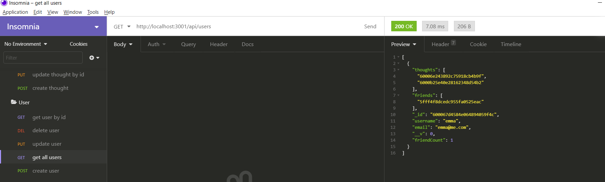
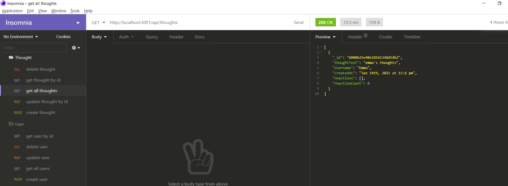

# Social Network Api

## Description
This social network api was created as the back end of a social networking application. The application has the ability to create a user, find a user by id, find all users, update user's information, and delete a user. Additionally the application has the ability to create a thought, find a thought by id, find all thoughts, update thought information, and delete a thought. Within each user, a friend's list can be added, which can be selected from the user id, and a reaction to thoughts can be logged. Friends and reactions can also be deleted. Please see this screencastify video to demonstrate functionality using Insomnia Core. [screencastify social network api]()

## Images 
  
  

## Installation
    npm install, MongoDB, Mongoose
## Usage
    For personal use.
## License
    none
## Contributors
    Joanna Grosshans, joannagrosshans2@gmail.com
    
## Questions
[GitHub](https://github.com/jgrossh2/social-network-api)  

# Technologies used
 * JS  
 * NODE  
 * MONGODB  
 * MONGOOSE 